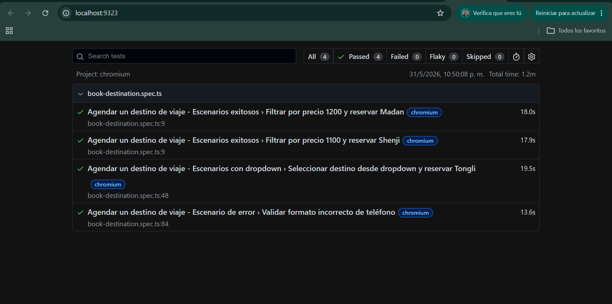
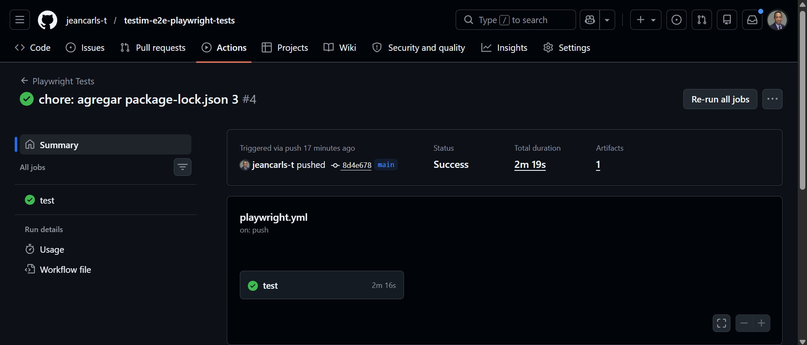

# 🎭 QA Automation - Playwright con TypeScript

[](https://playwright.dev/)
[](https://www.typescriptlang.org/)
[]()
[](https://github.com/jeancarls-t/qa-automation-testim-playwright/actions)

## 📋 Descripción

Suite de pruebas automatizadas **end-to-end** para la página demo [https://demo.testim.io/](https://demo.testim.io/).

### 🚀 Tecnologías utilizadas

| Tecnología | Versión | Propósito |
|------------|---------|-----------|
| Playwright | 1.46 | Automatización de navegadores |
| TypeScript | 5.0 | Tipado estático y mantenibilidad |
| Node.js | 20+ | Entorno de ejecución |

### ✨ Características implementadas

- ✅ Automatización E2E con Playwright
- ✅ Patrón **Page Object Model** (POM)
- ✅ Datos parametrizados (múltiples escenarios)
- ✅ Validaciones de errores (SSN inválido, teléfono inválido)
- ✅ Generación de reportes HTML
- ✅ CI/CD con GitHub Actions

---

## 🎯 Escenarios cubiertos

| # | Escenario | Tipo | Estado |
|---|-----------|------|--------|
| 1 | Filtrar precio 1200 y reservar **Madan** | Exitoso | ✅ |
| 2 | Filtrar precio 1100 y reservar **Shenji** | Exitoso | ✅ |
| 3 | Seleccionar **Tongli** desde dropdown | Exitoso | ✅ |
| 4 | Validar error de teléfono inválido | Error esperado | ✅ |

### 📸 Evidencias de ejecución

| Escenario | Captura |
|-----------|---------|
| Reporte de Serenity/Playwright | `./images/reporte.png` |
| Ejecución de pruebas en CI | `./images/ci-passing.png` |
| Escenario Madan ejecutándose | `./images/madan-test.png` |

> **Nota:** Las imágenes deben estar en la carpeta `images/` de tu repositorio.

---

## 🔧 Instalación y configuración

### 1. Clonar el repositorio

```bash
git clone https://github.com/jeancarls-t/qa-automation-testim-playwright.git
cd qa-automation-testim-playwright

2. Instalar dependencias
npm install

3. Instalar navegadores de Playwright
npx playwright install

🚀 Ejecutar pruebas
npx playwright test

Local (ver navegador - headed)
npx playwright test --headed

Ver reporte HTML
npx playwright show-report

Ejecutar un escenario específico
npx playwright test --grep "Madan"

📊 Reportes generados
Reporte	Ubicación	Visualización
HTML	playwright-report/index.html	Navegador web
JSON	test-results.json	Editor de código
Traza	test-results/	npx playwright show-trace

📁 Estructura del proyecto
qa-automation-testim-playwright/
├── .github/
│   └── workflows/
│       └── playwright.yml      # CI/CD pipeline
├── tests/
│   ├── pages/                  # Page Objects
│   │   ├── HomePage.ts
│   │   ├── DestinationsPage.ts
│   │   └── CheckoutPage.ts
│   ├── fixtures/               # Datos de prueba
│   │   └── testData.ts
│   └── specs/                  # Casos de prueba
│       └── book-destination.spec.ts
├── images/                     # Evidencias (opcional)
├── playwright.config.ts        # Configuración de Playwright
├── tsconfig.json               # Configuración de TypeScript
├── package.json                # Dependencias
└── README.md                   # Este archivo

🔄 CI/CD con GitHub Actions
El pipeline se ejecuta automáticamente en cada push o pull request a la rama main.Última ejecución
Status	Branch	Commit	Fecha
✅ Pasando	main	Ver commit	2026-05-31
Ver resultados en GitHub Actions
# Ir a la pestaña "Actions" del repositorio
https://github.com/jeancarls-t/qa-automation-testim-playwright/actions

🐛 Bugs encontrados y reportados

ID	Bug	Severidad	Estado
BUG-1	Botón "LOAD MORE" no carga más destinos	Alta	Reportado
BUG-2	Botón "PAY NOW" no se habilita	Media	Reportado
BUG-3	Mensaje final es "X Temperatures" no "Destination Booked"	Baja	Documentado
 Nota: Ver BUGS_REPORT.md para más detalles.


 👤 Autor
Jean Carlos Caro N.
QA Automation Engineer

📄 Licencia
Este proyecto fue desarrollado como prueba técnica para Puntos Colombia / SQA S.A.
Uso exclusivamente académico y de evaluación.




*Pipeline de GitHub Actions en verde*